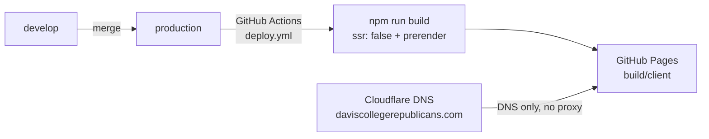

# Welcome to the Davis College Republicans web repo (daviscollegerepublicans.com static webpage repo)

<p align="center">
  <a href="https://daviscollegerepublicans.com">
    
  </a>
</p>


<p align="center">
  <strong><a href="https://daviscollegerepublicans.com">daviscollegerepublicans.com</a></strong>
</p>

[](LICENSE)


This repository powers the frontend code behind the Davis College Republicans [daviscollegerepublicans.com](https://daviscollegerepublicans.com) static website.

Davis College Republicans - associated with the California College Republicans - strives to serve as an informative club for conservative politics at UC Davis, run by Republican students for Republican students. In an environment that is often hostile to right wing politics, our club serves to promote free speech and debate to strengthen our public-speaking skills and own opinions. We meet weekly to discuss current events, host speakers, volunteer in the community, and hang out off-campus.

---

# Repository Maintainers

- The primary webpage / repo maintainer & creator of this repository is [Vijit Dua](https://vijitdua.com) (`@vijitdua` on the club Discord).

- The domain owner is **David Brownlee** (`@dalekvaderofborg` on the club Discord). He owns [daviscollegerepublicans.com](https://daviscollegerepublicans.com) on Cloudflare (DNS, billing). Contact him for domain / DNS questions.

- Please contact `@vijitdua` directly on the club Discord server for any changes needed to this website until June 2027 (Vijit's graduation). Non-members can use [vijitdua.com/support](https://vijitdua.com/support). See also [`/support`](https://daviscollegerepublicans.com/support) on the live site.

- After June 2027, please choose a new repo maintainer & update this ReadMe (and `app/config/site.ts`) with the new maintainer's contact information - though Vijit may still help out on a voluntary basis if needed, depending on time constraints. You can contact Vijit on Discord (if he's still active there) or @ [vijitdua.com/contact](https://vijitdua.com/contact) if he isn't responsive on the club Discord post graduation.

---

# Architecture

This is a Vite + React Router (framework mode) + Tailwind CSS v4 static site. Site knobs (Discord invite, webhooks, meetings copy, maintainer strings) live in [`app/config/site.ts`](app/config/site.ts).

## Infrastructure / Ownership



### Static Generation & GitHub Pages
- We deploy by using **React Router with `ssr: false` + `prerender`** ([`react-router.config.ts`](react-router.config.ts)). That bakes real HTML for `/`, `/contact`, `/join`, `/support`, and `/discord` into `build/client`. The build script then copies React Router’s SPA shell to `404.html` so unknown paths get a real **HTTP 404** from GitHub Pages (SPA boots → `$` route → NotFound UI — not a fake 200).
- `public/CNAME` tells Pages the custom domain is `daviscollegerepublicans.com`. `public/.nojekyll` tells Pages not to run Jekyll on the uploaded files (avoids Jekyll mangling asset paths).
- The generated static content is then hosted on GitHub Pages by **[`.github/workflows/deploy.yml`](.github/workflows/deploy.yml)**: on every push to `production`, Actions runs `npm ci` → `npm run build` → uploads `build/client` → `actions/deploy-pages` → creates an incrementing dated tag/release (`v2026.10.07.1`, `.2` same day, etc.) as `github-actions[bot]`.

**One-time repo setup:** Settings → Pages → Source: **GitHub Actions**; set custom domain `daviscollegerepublicans.com`; enable HTTPS after DNS verifies.

### Cloudflare

- Domain ownership: The domain [daviscollegerepublicans.com](https://daviscollegerepublicans.com) is owned by David Brownlee (@dalekvaderofborg on discord) as of October 6, 2026
- Costs: $10/yr
- Connection to static data: This domain points directly to our github pages, with no proxy enabled (no IP address to hide, no need for unecessary added latency)
- Email: **TBD — not set up yet.** Plan (when David/Vijit get to it): Cloudflare Email Routing for a receive-only `inbox@daviscollegerepublicans.com` that forwards to `daviscollegerepublican@gmail.com`. Until then, do not assume club email works.

**Current DNS setup (as of Oct 2026)** — Cloudflare DNS only, **proxy off** (grey cloud) on every record that points at GitHub Pages. Do not orange-cloud / proxy these; Pages needs to see the real client TLS handshake for custom-domain HTTPS.

| Name | Type | Content / target | Proxy | Notes |
| --- | --- | --- | --- | --- |
| `@` (apex) | `A` ×4 | `185.199.108.153`, `185.199.109.153`, `185.199.110.153`, `185.199.111.153` | DNS only | Official GitHub Pages IPs for apex domains |
| `www` | `CNAME` | `Davis-College-Republicans.github.io` | DNS only | Org Pages hostname; GitHub can redirect www ↔ apex once both are set |
| (email) | — | — | — | **TBD** — Cloudflare Email Routing not configured yet |

If GitHub ever publishes new Pages IPs, update the apex `A` records to match [GitHub’s custom-domain docs](https://docs.github.com/en/pages/configuring-a-custom-domain-for-your-github-pages-site/managing-a-custom-domain-for-your-github-pages-site). David (`@dalekvaderofborg`) is the person who can change these in Cloudflare. 

---

# Workflow

How we actually work in this repo (separate from “how the site is built/hosted” above). Same spirit as [Aggie Schedule Sniper’s contributing notes](https://github.com/vijitdua/aggie-schedule-sniper/blob/develop/CONTRIBUTING.md): keep the integration branch usable, use issue-linked branches when work gets messy.

## Branches

| Branch | Purpose |
| --- | --- |
| `develop` | Integration / day-to-day. Does **not** update the live site. Prefer this branch stay in a **finished, shippable** state. |
| `production` | Live site. Push here → GitHub Actions deploys to GitHub Pages + dated release tag (`vYYYY.MM.DD.N`). |

## Working on `develop`

**Single maintainer (the usual case):** free for all — commit straight to `develop`. Just make sure you only push **finished** work. Never leave half-done WIP sitting on `develop`, so anyone (including future-you) can still tweak the webpage from `develop` directly if needed.

**Multiple maintainers ever working at once:** please make a **new branch off `develop`**, finish the change there, and **open a PR into `develop`**. Don’t race unfinished commits onto the shared integration branch.

## If things ever get chaotic

For a static club webpage like this this is highly unlikely — this is not a big technical product — but if problems ever grow a shit ton:

1. Open a **GitHub issue** for the bug/feature.
2. Branch off `develop` named like `develop-#<issue-number>` (e.g. `develop-#12` or `develop-12-fix-footer`), same idea as issue-linked branches in Aggie Schedule Sniper (`42-short-name` / PR into `develop`).
3. Open a PR from that branch → `develop`.
4. When `develop` is good, merge/ship to `production` as usual.

Keep PRs small and one logical change at a time when you’re in that mode.

## Shipping to production

```bash
# day-to-day (single maintainer): finish work, then
git checkout develop
git push origin develop

# ship the live site
git checkout production
git merge develop
git push origin production   # triggers deploy.yml → Pages + dated release tag
```

Or open a PR from `develop` → `production` and merge.

---

# Development Notes

- Since content is hosted on github pages - which only support static components - please do not use any react server components or any dynamic SSR components (no server-only loaders/actions that need Node at request time).
- This is to ensure hosting this webpage remains economically viable for DCR.

## Getting Started

Ensure you have NPM and Node installed before you begin (Node 22+ recommended).

### Installation

Install the dependencies:

```bash
npm install
```

### Development

Start the development server with HMR:

```bash
npm run dev
```

Your application will be available at `http://localhost:5173`.

## Building for Production

Create a production build (static files land in `build/client`, including `404.html`):

```bash
npm run build
npm run preview   # optional: serve build/client locally on :4173
```

## Deployment

**Primary:** GitHub Pages via push to `production` (see [Workflow → Shipping to production](#shipping-to-production)). Actions file: [`.github/workflows/deploy.yml`](.github/workflows/deploy.yml).

**Backup hosts** (if we ever leave GitHub Pages): point any static host at the same `build/client` output and keep the `404.html` SPA fallback. Examples that work with a static folder:

- Cloudflare Pages
- Netlify
- AWS S3 + CloudFront
- Any “static site” / object-storage CDN

### Docker — not needed right now

Docker is **not** used for production today. GitHub Pages (and the static backup hosts above) just serve files from `build/client` — no container, no Node server at request time.

There is still a root [`Dockerfile`](Dockerfile) left over from the React Router template. **Ignore it** while we stay on static hosting.

**If we ever change architectures** (e.g. turn SSR back on, need a Node server, move to Cloud Run / Fly / a VPS, etc.), that Dockerfile is the starting point:

```bash
# after the app can actually `npm run start` a Node server again
docker build -t dcr-site .
docker run -p 3000:3000 dcr-site
```

You’d need to restore a real `start` script (the template used `react-router-serve ./build/server/index.js`), flip `ssr` appropriately in [`react-router.config.ts`](react-router.config.ts), and point DNS at whatever host runs the container — not at GitHub Pages. Until then: don’t bother with Docker.

## Styling

This project uses [Tailwind CSS](https://tailwindcss.com/) v4 plus shared styles in [`app/app.css`](app/app.css).

---
